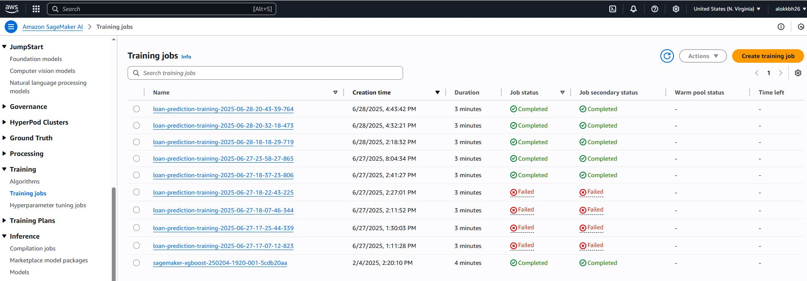
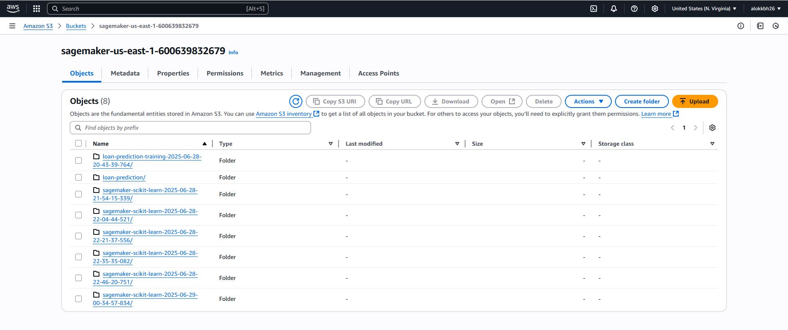
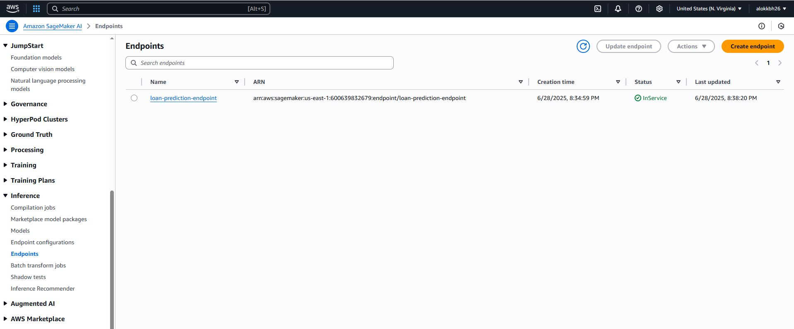

# 🏦 Loan Prediction Pipeline with SageMaker Deployment

This project implements an **end-to-end machine learning pipeline** for predicting loan approvals using scikit-learn and AWS SageMaker. It automates data preprocessing, feature engineering, model training (Logistic Regression, Random Forest, XGBoost), evaluation, and deployment as a SageMaker endpoint with **CI/CD integration via GitHub Actions**.

---

## 🚀 **Project Highlights**

- **Data pipeline**: Cleaned raw data, applied domain-specific feature engineering.
- **Model training**: Trained multiple models and saved best model based on F1 score.
- **MLOps with SageMaker**:
  - Trained model using SageMaker SKLearn Estimator.
  - Deployed model as a SageMaker endpoint with automated endpoint cleanup.
  - Performed inference from endpoint within CI/CD pipeline.
- **CI/CD**: Automated build, test, train, and deployment via GitHub Actions on every push.

---

## 📁 **Project Structure**

```
Loan_Prediction/
├── .github/
│ └── workflows/
│ 	└── cicd.yaml
├── config/
│ └── config.yaml
├── Data/
│ ├── loan_data.csv
│ └── loan_df_cleaned.csv
├── models/
│ ├── best_model.pkl
│ ├── metrics_LogisticRegression.json
│ ├── metrics_RandomForest.json
│ ├── metrics_XGBoost.json
│ └── metrics.json
├── notebooks/
│ └── notebook.ipynb
├── sagemaker/
│ ├── sagemaker_deploy.py
│ ├── sagemaker_inference.py
│ └── sagemaker_trainer.py
├── src/
│ ├── config.py
│ ├── data_loader.py
│ ├── evaluate.py
│ ├── feature_engineering.py
│ ├── inference.py
│ ├── preprocessing.py
│ └── train.py
├── requirements.txt
├── run_pipeline.py
├── setup.py
├── test.py
├── train_script.py
```

## 🔄 **CI/CD Pipeline**

This project includes GitHub Actions CI/CD (`.github/workflows/cicd.yaml`) to:

- ✅ Install dependencies
- ✅ Package the application
- ✅ Train model using SageMaker Estimator
- ✅ Deploy trained model as a SageMaker endpoint
- ✅ Perform inference test from the deployed endpoint

**Note**: The pipeline skips training if model artifact exists.

---

## 🖼️ **Project Demonstration**

Below are screenshots demonstrating SageMaker integration:

- ✅ **1. Training Jobs**
  
  

- ✅ **2. Model Artifacts in S3**
  
  

- ✅ **3. Deployed Endpoint**
  
  ---

## 🔧 **Technologies Used**

- **Machine Learning**: Scikit-learn, XGBoost
- **Cloud Platform**: AWS SageMaker
- **CI/CD**: GitHub Actions
- **Data Processing**: Pandas, NumPy
- **Model Evaluation**: Classification metrics (F1 score, accuracy, precision, recall)

---

## 📊 **Model Performance**

The pipeline evaluates multiple models and selects the best performer based on F1 score:
- Logistic Regression
- Random Forest
- XGBoost

---
